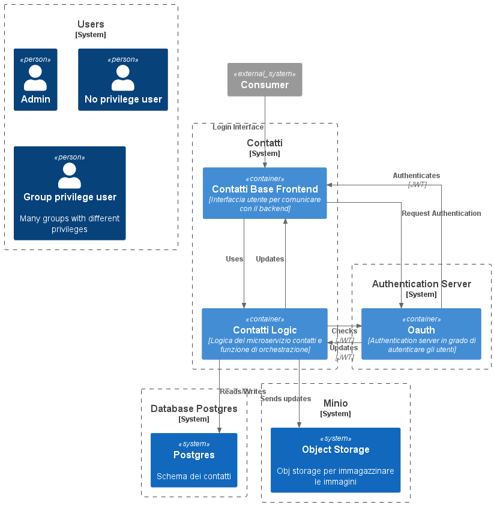

# Architettura

## Architettura logica

Di seguito riportato il diagramma della soluzione architetturale

## Elenco componenti

| Componente | Descrizione | Dipendenze |
|---|---|---|
| **Database contatti** | È il database che conterrà i dati dei contatti | Nessuna |
| **Contatti base** | È il componente per il frontend che restituirà i risultati delle chiamate al backend | Backend |
| **Contatti logic** | È il componente di backend per la gestione dei servizi e orchestrazione delle chiamate | Nessuna |
| **OAuth** | Authentication server che permette agli utenti di fare il login e poi di accedere a risorse specifiche | Db, authentication server |
|  **Object Storage** |  Servizio che mantiene le immagini e le restituisce su chiamata | Backend |

## Tecnologia e servizi

Di seguito sono riportate le tecnologie utilizzate per lo sviluppo del progetto.

| Componente | Descrizione | Componenti |
|---|---|---|
| Spring Boot | Framework Java per lo sviluppo di microservizi | Contatti, Orchestratore contatti |
| OAuth2 | Componente per l'accesso con SSO al servizio | Oauth |
| Keycloak | Componente per la gestione degli accesssi, gestione dei privilegi e dei JWT | OAuth |
| Postgres | Database per l'archiviazione dei contatti | Postgres / CockroachDb |
| Minio | Object storage open | Minio |
