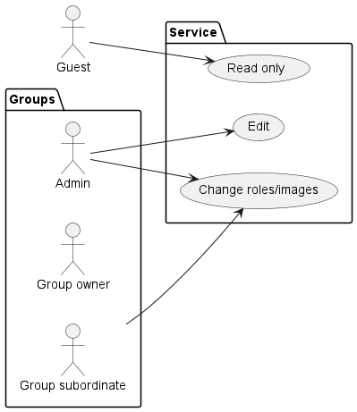

# Contesto ed ambito business

## Diagramma del contesto business per l'AS IS

Il sistema attuale in esecuzione può essere inquadrato all'iterno del seguente contesto business.

In seguito a una analisi abbiamo identificato diversi ruoli interni con i propri casi d'uso e funzionalità.

* **Guest**: l'utente non registrato che può accedere al servizio ma in modo *solo lettura* e con funzionalità limitate quali *non poter visualizzare le immagini utente e i relativi ruoli*, oltre al fatto che alcuni gruppi sono nascosti.
* **Admin**: ha il permesso di vedere e modifciare tutti i ruoli, contatti e immagini all'interno del servizio.
* **Group owner**: ha il permesso di modificare e vedere solo i contatti all'interno del suo gruppo.
* **Group subordinate**: subordinato al gruppo, può solo visualizzare ma non modiciare contatti all'interno del gruppo.
