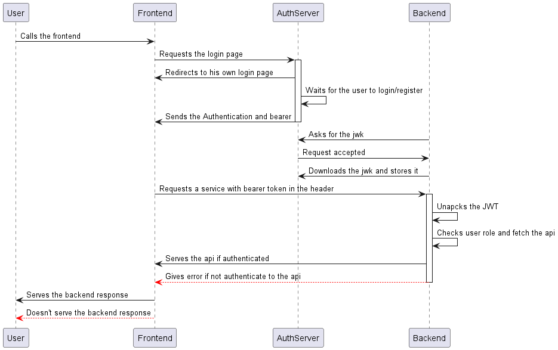

# Viste di runtime

In questa sezione verranno riportate le viste più importanti dell'applicativo

***

## Login

Analisi del metodo di **login** nell'applicativo:

I sistemi conivolti in questa azione sono:

* Frontend
* Backend / Orchestratore
* Authentication Server

Per ogni utente non registrato o senza sessione attiva che richiede la *Home* route avviene un *redirect* all'endpoint di login/register fornita dall'Authentication server **Keycloak**. Una volta effettuato il login viene generato il *JWT* e inviato nella header della risposta. Questo verrà poi sempre trasportato nelle richieste utente fino a quando non effettuerà il logout, sempre gestito da un endpoint di Keycloak. Una volta uscito dalla pagina di login l'utente potrà scegliere su quale rotta andare. Ogni rotta però ha un *livello di accesso* che può bloccare o meno l'accesso. Qualora l'utente chiamasse una route collegata a backend, viene inserito il JWT nella richiesta a backend (Spring Boot) dove viene controllato il token e, se è appartenente al gruppo gli viene restitutita la pagina richiesta.

***

## getContatcts

Analisi della route `getContacts`:

I sistemi conivolti in questa azione sono:

* Frontend
* Backend / Orchestratore
* Authentication Server
* Postgres Db

Quando un utente accede alla route `Contatti` viene fatta una chiamata in background sull'API `/getContacts` che traduce il *JWT token*, ne controlla i permessi e crea una query parametrica in base ai ruoli. Una volta ottenuto il risultato della query i dati vengono inseriti in una tabella e visualizzati nel frontend. Alcune delle caratteristiche verranno nascoste in base al gruppo di appartenenza dell'utente.

***

## putImage

Analisi della route `putImage`

I sistemi conivolti in questa azione sono:

* Frontend
* Backend / Orchestratore
* Object Storage

Quando un utente autenticato e con i giusti permessi accede alla route `Contatti` gli viene mostrata l'interfaccia di inserimento immagini per contatto nel db. In questa fase si può scegliere una immagine da attribuire ad ogni utente chiamando l'API `putImage`. Quando la richeista arriva al backend, questo elabora l'immagine dandole un nome e conatattando il servizio di *Object storage* e prova a inserire l'immagine in un bucket predefinito. In caso di successo l'immagine viene subito caricata e mostrata nel da frontend grazie alla sua reattività, altrimenti in caso di errore non verrà mostrata nessuna immagine e verrà gestito l'errore di inserimento con un messaggio.
